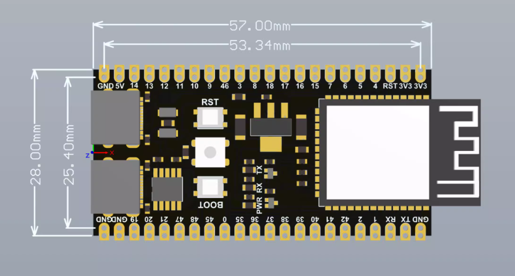
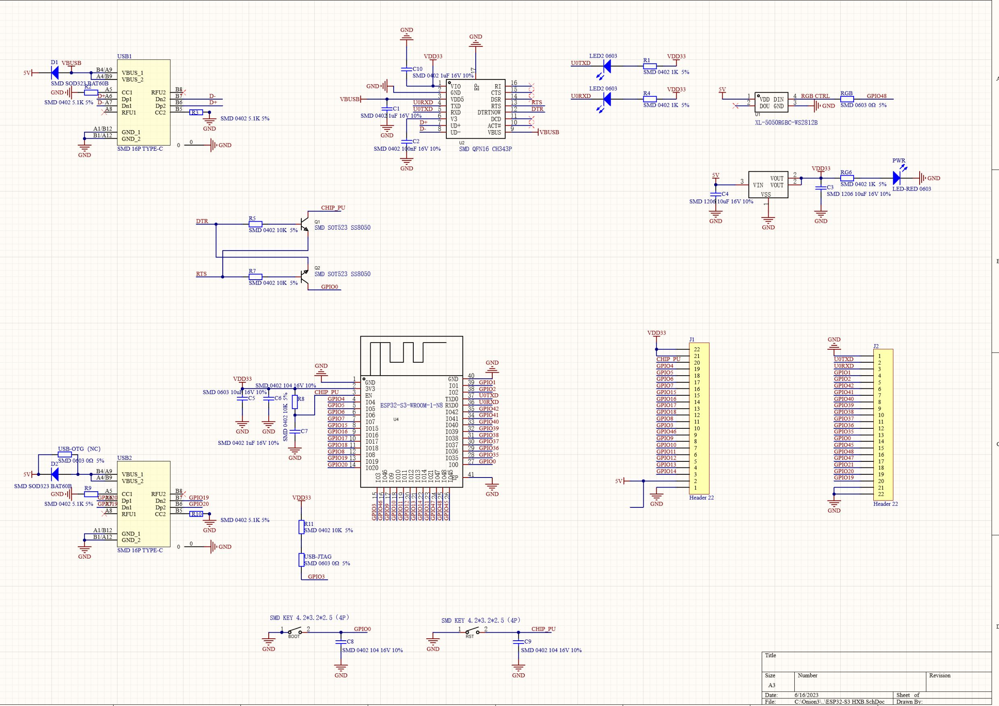
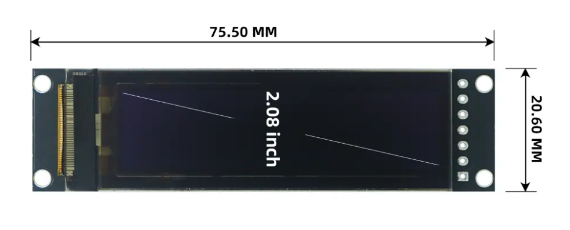
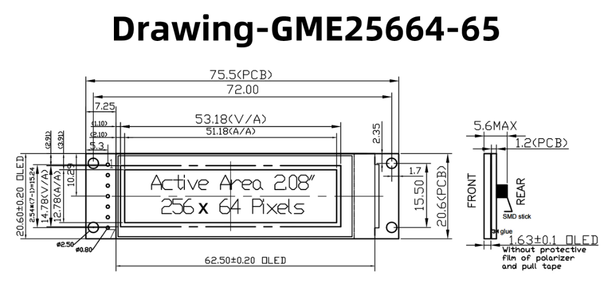
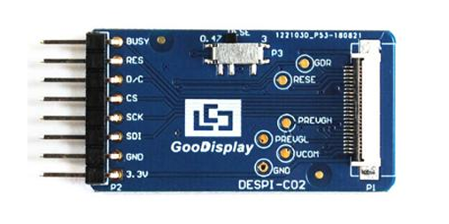
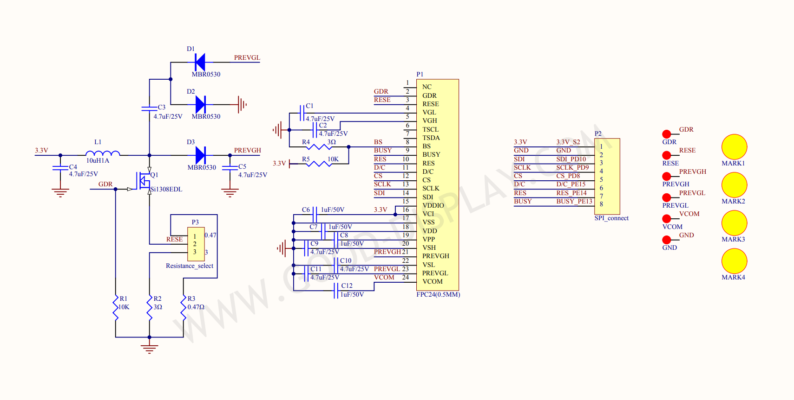
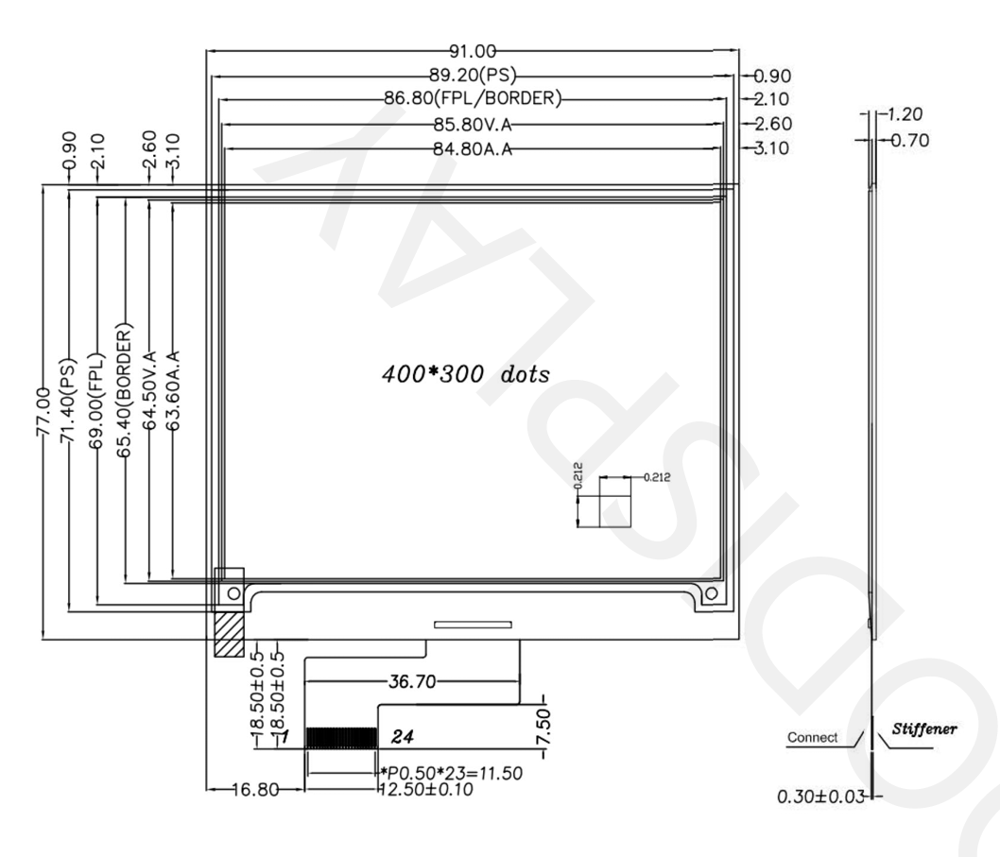
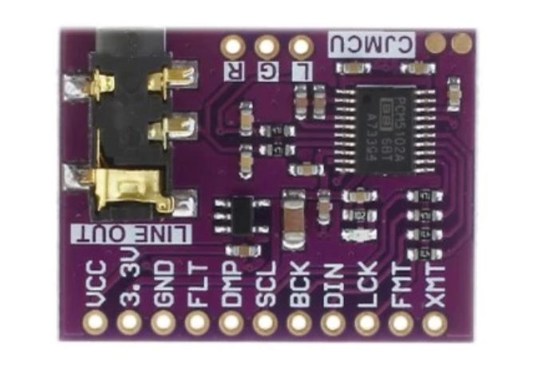
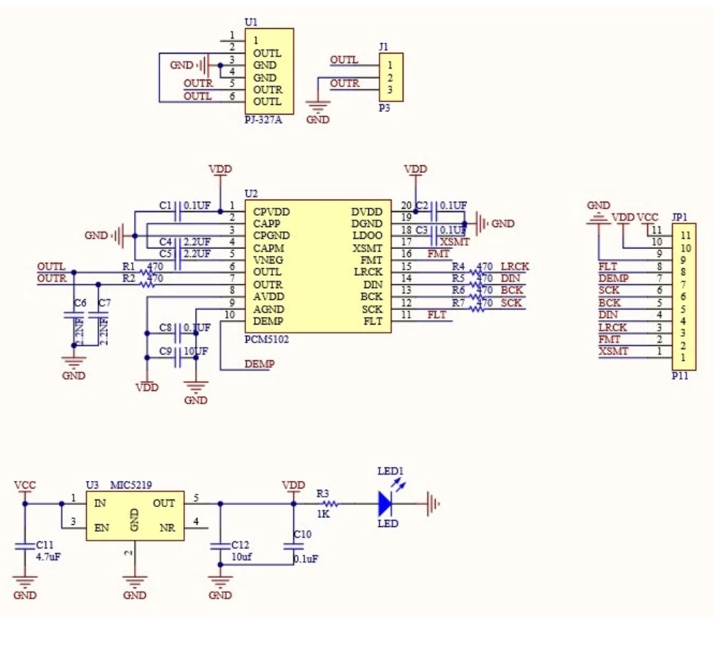
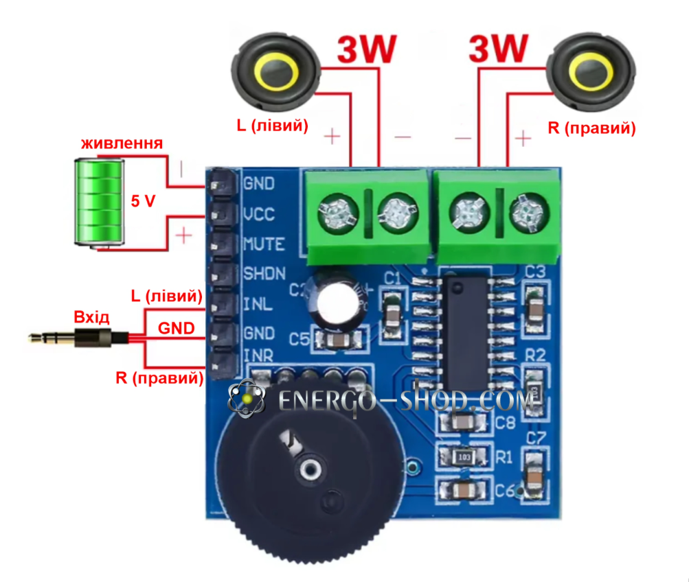

# Components

## 1. ESP32-S3 N16R8 (NoLogo 无名科技 third-party board)

Shop: https://pingjia.taobao.com/858e7bcc229b486ed1618ff9aa3f57e9.html
        https://item.taobao.com/item.htm?id=724415068331

## 2. 2.08" OLED: GME25664-65 (SH1122 module)

Official: https://goldenmorninglcd.com/oled-display-module/2.08-inch-256x64-sh1122-gme25664-65/

## 3. GoodDisplay adapter: DESPI-C02

Official: https://www.good-display.com/product/516.html

Datasheet: [despi-c02-datasheet](./specs/DESPI-C02.pdf)

## 4. GoodDisplay E-Paper: GDEY042T81

Official: https://www.good-display.com/product/386.html

Datasheet: [gdey042t81-datasheet](./specs/GDEY042T81.pdf)

## 5. CJMCU-5102 (PCM5102A DAC Module)

Shop: https://www.amazon.com/PCM5102A-CJMCU-Stereo-Converter-Module/dp/B0BYXX4N1Y

## 6. PAM8403

Shop: https://energo-shop.com/plata-stereo-audio-pidsyliuvach-d-klas-2x-3w-pam8403-z-rehuliuvanniam-zvuku/

## 7. Speakers (Pending Shipment)

# Reference Photo

